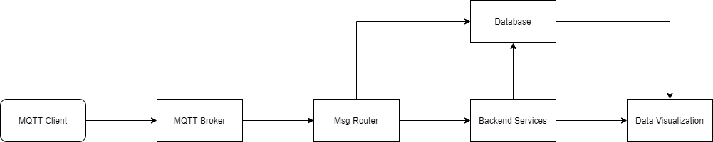

# IoT Platform
 
 
 A simple IoT platform base on open source project:


 * MQTT Broker : [EMQX Broker](https://github.com/emqx/emqx)
 * Message Proxy And Router : [Node-Red](https://github.com/node-red/node-red)
 * Database : [TDengine](https://github.com/taosdata/TDengine)
 * Data Visualization : [Grafana](https://github.com/grafana/grafana)

## Quick Start
### Start project
```
docker-compose up
```

### Test
* Send MQTT msg, use client like [MQTTX](https://mqttx.app/cn/)
* Iot-Biz service instance console will log received data

### Connection Management
To view the EMQX Broker dashboard, use your browser to open: http://localhost:18083  
Default account : admin/public
