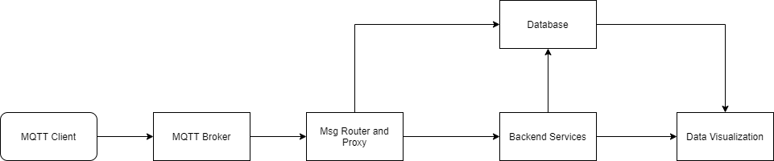

# IoT Platform
 A simple IoT platform base on open source project:

 * MQTT Broker : [EMQX Broker](https://github.com/emqx/emqx)
 * Message Proxy And Router : [Node-Red](https://github.com/node-red/node-red)
 * Database : [TDengine](https://github.com/taosdata/TDengine)
 * Data Visualization : [Grafana](https://github.com/grafana/grafana)